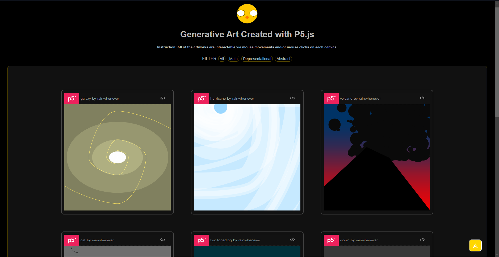

# Generative Art Portfolio

[Portfolio Website] (https://rainingchicken.github.io/Generative-Art-Portfolio/)

 https://rainingchicken.github.io/Generative-Art-Portfolio/ 

## Purpose

This will be the website in which I will display my collection of art created through programming in javascript in p5js. Visitors can hover their mouse over a canvas to interact with it, such as clicking to make a volcano explode more or moving the mouse around as a cat attentively watches. Simple quality of life features include scroll to top of screen button and filter system showing the categorized art such as representational and abstract. There is also a link that brings them to this github reportoir where they can view codes of the website as well as the codes used to create the art pieces which are in the folder sketchesCodes.
 

 
 

 (Updated 1/2/2024)
 

 ## Inspiration
 I have nothing to do and am doubting my degree. To make some use of it, I decided to apply mathematics to art. This serves to also test my knowledge. Being able to put it into practical use feels good, however, it is also feels like a waste of time. There was also little that I actually remember from school. I don't know if one would call it a passion, but I find that this is fun. I enjoy the creative and design aspect as well as the coding itself. I find myself wanting to figure out the coding like trying to solve a puzzle. Even as I am doing some other activities, I would think of how I would write the codes and look up and read information from MDN web doc, w3schools.com, geeksforgeeks, stack overflow, and more. While doing this I am learning about website design and development. I learned a little bit about graphic designs as a bonus. 

## How to embed
- I use the online p5.js editor at https://editor.p5js.org. 
- By File > Share > Embed, I copied the link and pasted each art in index.html at the bottom before body ends.

-----
###### Fails 
 <h6> 
 
1. I tried making html read .js scripts directly, however, they would overwrite one another--the last loaded canvas would sit on top of the previously loaded ones. Therefore, I tried putting an ID on the canvas. However, it also failed because in CSS, there was really no way for me to get that ID and position them. 

2. I tried hard coding there the canvas would sit in a window. For example, canvas 1 would sit on potision (0, 0, absolute) abd canvas two on position (0, 400, abolute). However, still, only one canvas was active while the other was blank. Interacting with both canvases with a mouse works but it only works and shows on one canvas. So, I am giving up right now and just embed each art.

</h6>
